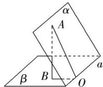

## 方法 2: 三垂线法求二面角

在平面 $\alpha$ 内选一点 A 向另一个平面 $\beta$ 作垂线 AB，垂足为 B，再过点 B 向棱 a 作垂线 BO，垂足为 O，连接 AO，则 $\angle AOB$ 就是二面角的平面角.

![[高中/课堂同步/题库/高中数学全练一本通/立体几何初步/第九节 专题-二面角的四种求法/▶ ▷ 重点题型专练/方法 2_ 三垂线法求二面角/questions/Q00006112.md]]
![[高中/课堂同步/题库/高中数学全练一本通/立体几何初步/第九节 专题-二面角的四种求法/▶ ▷ 重点题型专练/方法 2_ 三垂线法求二面角/questions/Q00006113.md]]
![[高中/课堂同步/题库/高中数学全练一本通/立体几何初步/第九节 专题-二面角的四种求法/▶ ▷ 重点题型专练/方法 2_ 三垂线法求二面角/questions/Q00006114.md]]
![[高中/课堂同步/题库/高中数学全练一本通/立体几何初步/第九节 专题-二面角的四种求法/▶ ▷ 重点题型专练/方法 2_ 三垂线法求二面角/questions/Q00006115.md]]
![[高中/课堂同步/题库/高中数学全练一本通/立体几何初步/第九节 专题-二面角的四种求法/▶ ▷ 重点题型专练/方法 2_ 三垂线法求二面角/questions/Q00006116.md]]
![[高中/课堂同步/题库/高中数学全练一本通/立体几何初步/第九节 专题-二面角的四种求法/▶ ▷ 重点题型专练/方法 2_ 三垂线法求二面角/questions/Q00006117.md]]
![[高中/课堂同步/题库/高中数学全练一本通/立体几何初步/第九节 专题-二面角的四种求法/▶ ▷ 重点题型专练/方法 2_ 三垂线法求二面角/questions/Q00006118.md]]
