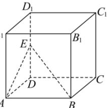

<!-- question-source:start -->
【12】（2024·全国高三模拟预测）如图, 在正方体 $ABCD - A_{1}B_{1}C_{1}D_{1}$ 中, 点 E 是 $DD_{1}$ 的中点, 则平面 ABE 与底面 ABCD 所成角的正切值是（）

A. $\frac{\sqrt{2}}{2}$ B. $\frac{1}{2}$ C. 1 D. 2
<!-- question-source:end -->

![[Q00006119A1]]
