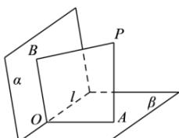

> [!faq]- 全练一本通解析
> **【答案】** $\frac{2\pi}{3}$
>
> **【解析】**
> 
> 如图, 设平面 PAB 交直线 l 于点 O, 连接 OA, OB由于 $PA \perp \beta, PB \perp \alpha, l \subset \alpha, l \subset \beta$ 故 $PA \perp l, PB \perp l$ ，又 $PA \cap PB = P$ 故 $l \perp$ 平面 $PAB$ ，又 $OA, OB \subset$ 平面 $PAB$ 故 $l \perp OA, l \perp OB$ $\therefore \angle AOB$ 为二面角 $\alpha - l - \beta$ 的平面角
> 由于 $PA \perp \beta, PB \perp \alpha, OB \subset \alpha, OA \subset \beta$ 故 $PA \perp OA, PB \perp OB$ 故在四边形 $PAOB$ 中， $\angle APB, \angle AOB$ 互补
> 故 $\angle AOB = 180^\circ - 60^\circ = 120^\circ$ 则二面角 $\alpha - l - \beta$ 的大小为 $120^\circ$ 故答案为： $120^\circ$
