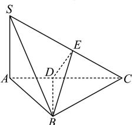

> [!faq]- 全练一本通解析
> **【答案】** 60°
>
> **【解析】**
> 因为 SB = BC 且 E 是 SC 的中点, 所以 BE 是等腰 $\triangle SBC$ 底边 SC 的中线, 可得 SC⊥BE,
> 又因为 SC⊥DE, BE∩DE = E, 且 BE, DE⊂平面 BDE,
> 所以 SC⊥平面 BDE, 所以 SC⊥BD,
> 因为 SA⊥平面 ABC, BD⊂平面 ABC, 所以 SA⊥BD,
> 又因为 SC∩SA=A 且 SC, SA⊂平面 SAC, 所以 BD⊥平面 SAC,
> 因为平面 SAC∩平面 BDE=DE, 平面 SAC∩平面 BDC=DC,
> 所以 BD⊥DE, BD⊥DC, 所以∠EDC是所求二面角的平面角,
> 因为 SA⊥底面 ABC, 且 AB, AC⊂底面 ABC, 所以 SA⊥AB, SA⊥AC,
> 设 SA=2, 则 AB=2, BC=SB=2√2,
> 因为 AB⊥BC, 可得 AC=2√3, 所以 $\angle ACS=30^{\circ}$ ,
> 又由 DE⊥SC, 所以 $\angle EDC=60^{\circ}$ , 即所求的二面角等于 $60^{\circ}$ .
> 
