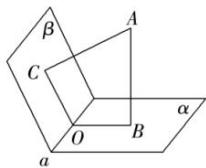

## 方法 3: 垂面法求二面角

过二面角内一点 A 作 $AB \perp \alpha$ 于 B，作 $AC \perp \beta$ 于 C，平面 ABC 交棱 a 于点 O，则 $\angle BOC$ 就是二面角的平面角.

![[高中/课堂同步/题库/高中数学全练一本通/立体几何初步/第九节 专题-二面角的四种求法/▶ ▷ 重点题型专练/方法 3_ 垂面法求二面角/questions/Q00006119.md]]
![[高中/课堂同步/题库/高中数学全练一本通/立体几何初步/第九节 专题-二面角的四种求法/▶ ▷ 重点题型专练/方法 3_ 垂面法求二面角/questions/Q00006120.md]]
![[高中/课堂同步/题库/高中数学全练一本通/立体几何初步/第九节 专题-二面角的四种求法/▶ ▷ 重点题型专练/方法 3_ 垂面法求二面角/questions/Q00006121.md]]
![[高中/课堂同步/题库/高中数学全练一本通/立体几何初步/第九节 专题-二面角的四种求法/▶ ▷ 重点题型专练/方法 3_ 垂面法求二面角/questions/Q00006122.md]]
![[高中/课堂同步/题库/高中数学全练一本通/立体几何初步/第九节 专题-二面角的四种求法/▶ ▷ 重点题型专练/方法 3_ 垂面法求二面角/questions/Q00006123.md]]
