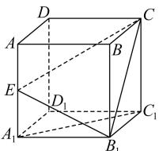

<!-- question-source:start -->
【17】(2023·全国高三专题练习)如图,已知正方体 $ABCD-A_{1}B_{1}C_{1}D_{1}$ ，E为棱 $AA_{1}$ 中点，则平面 $EB_{1}C$ 和平面 $A_{1}B_{1}C_{1}D_{1}$ 夹角的余弦值为\_\_\_\_.

<!-- question-source:end -->

![[Q00006124A1]]
