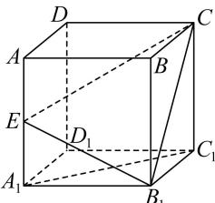

> [!faq]- 全练一本通解析
> **【答案】** $\frac{2}{3}$
>
> **【解析】**
> 设正方体 $ABCD - A_{1}B_{1}C_{1}D_{1}$ 的边长为 2，则 $S_{\triangle A_{1}B_{1}C_{1}} = \frac{1}{2} \times 2 \times 2 = 2$ ；
> 在 $\triangle EB_{1}C$ 中， $EB_{1}=\sqrt{5}$ ，EC=3， $CB_{1}=2\sqrt{2}$ ，
> 利用余弦定理
> $\cos \angle ECB_{1} = \frac{CE^{2} + B_{1}C^{2} - B_{1}E^{2}}{2\times CE\times B_{1}C} = \frac{9 + 8 - 5}{2\times 3\times 2\sqrt{2}} = \frac{\sqrt{2}}{2}\Rightarrow \sin \angle ECB_{1} = \frac{\sqrt{2}}{2},$ 则 $S_{\triangle B_1CE} = \frac{1}{2}\times 3\times 2\sqrt{2}\times \frac{\sqrt{2}}{2} = 3$ ；则 $\cos \theta = \frac{S_{\triangle A_1B_1C_1}}{S_{\triangle B_1CE}} = \frac{2}{3}$ .
> 
> $$
> - \frac {\sqrt {5}}{5}
> $$
