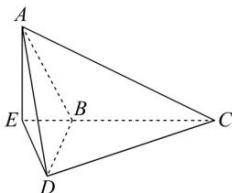

> [!faq]- 全练一本通解析
> **【答案】** 详见解析
>
> **【解析】**
> 解析: 过 A 作 $AE \perp CB$ 的延长线于 E，连结 DE，
> ∵平面 ABC⊥平面 BCD，平面 ABC∩平面 BCD=BC，
> ∴ AE⊥平面 BCD
> 
> ∴ E 点即为点 A 在平面 BCD 内的射影，
> ∴ $\triangle BDE$ 为 $\triangle ABD$ 在平面 BCD 内的射影，
> 设 AB = a，则 $AE = DE = AB \cdot \sin 60^{\circ} = \frac{\sqrt{3}}{2} a$ ∴ $AD = \frac{\sqrt{6}}{2} a$ ，由余弦定理可得 $\cos \angle ABD = \frac{1}{4}$ ，∴ $\sin \angle ABD = \frac{\sqrt{15}}{4}$ ，
> ∴ $S_{\triangle ABD} = \frac{1}{2} a^{2} \times \frac{\sqrt{15}}{4} = \frac{\sqrt{15}}{8} a^{2}$ 又 $BE=\frac{1}{2}a,\therefore S_{\triangle BDE}=\frac{1}{2}\times\frac{\sqrt{3}}{2}a\times\frac{1}{2}a=\frac{\sqrt{3}}{8}a^{2}$ 设二面角 A-BD-E 为 $\theta$ ，∴ $\cos\theta=\frac{S_{\triangle BDE}}{S_{\triangle ABD}}=\frac{\sqrt{5}}{5}$ .
> 而二面角 A-BD-C 与 A-BD-E 互补，
> ∴二面角 A-BD-C 的余弦值为 $-\frac{\sqrt{5}}{5}$ . 故答案为： $-\frac{\sqrt{5}}{5}$
