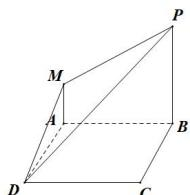
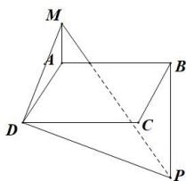

> [!faq]- 全练一本通解析
> **【答案】** $\frac{\sqrt{6}}{3}$ 或 $\frac{\sqrt{14}}{7}$
>
> **【解析】**
> 设平面 PMD 与平面 ABCD 所成角的大小为 $\theta$ ,
> △MPD 在平面 ABCD 上的射影为 △ABD，易得 $S_{\triangle ABD}=2$ .
> 当 M, P 在平面 ABCD 同侧时，如图所示：
> 
> $MD = MP = \sqrt{5}, DP = \sqrt{\left(2\sqrt{2}\right)^{2} + 2^{2}} = 2\sqrt{3},$ $S_{\triangle MPD}=\frac{1}{2}\times2\sqrt{3}\times\sqrt{\left(\sqrt{5}\right)^{2}-\left(\sqrt{3}\right)^{2}}=\sqrt{6},$ ∴ $\cos\theta=\frac{S_{\triangle ABD}}{S_{\triangle MPD}}=\frac{\sqrt{6}}{3}$ . 当 M, P 在平面 ABCD 异侧时，如图所示：
> 
> $$
> M D = \sqrt {5}, M P = \sqrt {2 ^ {2} + 3 ^ {2}} = \sqrt {1 3}, D P = \sqrt {\left(2 \sqrt {2}\right) ^ {2} + 2 ^ {2}} = 2 \sqrt {3}
> $$
> $$
> \cos \angle D M P = \frac {M D ^ {2} + M P ^ {2} - D P ^ {2}}{2 M D \cdot M P} = \frac {3}{\sqrt {6 5}}, \sin \angle D M P = \frac {2 \sqrt {1 4}}{\sqrt {6 5}},
> $$
> $$
> S _ {\triangle M P D} = \frac {1}{2} \times M D \times M P \times \sin \angle D M P = \sqrt {1 4},
> $$
> $$
> \therefore \cos \theta = \frac {S _ {\triangle A B D}}{S _ {\triangle M P D}} = \frac {\sqrt {1 4}}{7},
> $$
> 所以平面 $PMD$ 与平面 $ABCD$ 所成角的余弦值为 $\frac{\sqrt{6}}{3}$ 或 $\frac{\sqrt{14}}{7}$
> 故答案为: $\frac{\sqrt{6}}{3}$ 或 $\frac{\sqrt{14}}{7}$ .
