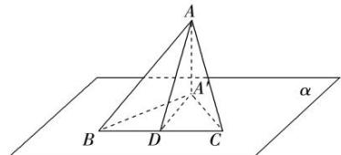

## 方法 4: 射影面积法求二面角

已知平面 $\beta$ 内一个多边形的面积为S,它在平面 $\alpha$ 内的射影图形的面积为 $S_{射影}$ ，平面 $\alpha$ 和平面 $\beta$ 所成的二面角的大小为 $\theta$ ，则 $\cos\theta=\frac{S_{射影}}{S}$ .
下面以多边形射影为三角形为例证明.
证明:如图,平面 $\beta$ 内的 $\triangle ABC$ 在平面 $\alpha$ 的射影为 $\triangle A^{\prime}BC$ ,作 $AD\perp BC$ 于D,连接A'D.
∵AA'⊥α于A',D∈α,
∴AD在 $\alpha$ 内的射影为A'D.
∵AA'⊥α,又BC⊂α,∴AA'⊥BC,又AD⊥BC,
AD∩A'A=A,AD,A'A⊂平面AA'D,
∴BC⊥平面AA'D,又A'D⊂平面AA'D,
∴A'D⊥BC.
∴∠ADA'为二面角 $\alpha-BC-\beta$ 的平面角.
设△ABC和△A'BC的面积分别为S和S',∠ADA'=θ,则 $S=\frac{1}{2}BC\cdot AD,S'=\frac{1}{2}BC\cdot A'D.$ ∴ $\cos\theta=\frac{A^{'D}}{AD}=\frac{\frac{1}{2}BC\cdot A^{'D}}{\frac{1}{2}BC\cdot AD}=\frac{S'}{S}.$

![[高中/课堂同步/题库/高中数学全练一本通/立体几何初步/第九节 专题-二面角的四种求法/▶ ▷ 重点题型专练/方法 4_ 射影面积法求二面角/questions/Q00006124.md]]
![[高中/课堂同步/题库/高中数学全练一本通/立体几何初步/第九节 专题-二面角的四种求法/▶ ▷ 重点题型专练/方法 4_ 射影面积法求二面角/questions/Q00006125.md]]
![[高中/课堂同步/题库/高中数学全练一本通/立体几何初步/第九节 专题-二面角的四种求法/▶ ▷ 重点题型专练/方法 4_ 射影面积法求二面角/questions/Q00006126.md]]
![[高中/课堂同步/题库/高中数学全练一本通/立体几何初步/第九节 专题-二面角的四种求法/▶ ▷ 重点题型专练/方法 4_ 射影面积法求二面角/questions/Q00006127.md]]
![[高中/课堂同步/题库/高中数学全练一本通/立体几何初步/第九节 专题-二面角的四种求法/▶ ▷ 重点题型专练/方法 4_ 射影面积法求二面角/questions/Q00006128.md]]
