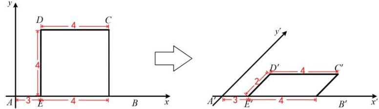

## 2. 平面图形的直观图的斜二测画法

步骤如下:

①在平面图形上取互相垂直的 x 轴和 y 轴, 作出与之对应的 $x'$ 轴和 $y'$ 轴, 使得它们正方向的夹角 $45^{\circ}$ （或 $135^{\circ}$ ）.

②平面图形中与x轴平行（或重合）的线段画成与 $x'$ 轴平行（或重合）的线段，且长度不变.

平面图形中与 y 轴平行（或重合）的线段画成与 $y'$ 轴平行（或重合）的线段，且长度为原来长度的一半.

③连接有关线段, 擦去作图过程中的辅助线.

重点: 当平面图形当中如果没有与 y 轴平行的线段, 则可以借助辅助线, 画出一条与 y 轴平行的辅助线, 然后确定关键点的位置, 并补全图形.
