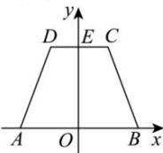
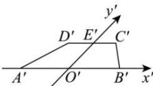

> [!faq]- 全练一本通解析
> **【答案】** 答案见解析
>
> **【解析】**
> 取等腰梯形底边 AB, CD 的中点 O, E, 连接 OE, 以 O 为原点, 以 AB, OE 所在的直线分别为 x, y 轴建立平面直角坐标系, 如图所示, 画出对应的 $x', y'$ 轴, 使 $\angle x'O'y' = 45^{\circ}$ , 结合斜二测画法的画法, 如图所示,
> 可得等腰梯形 ABCD 的直观图为 $A'B'C'D'$ ,
> 
> 
