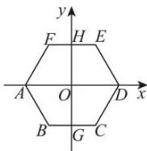
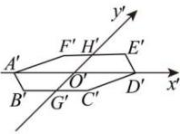
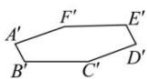

> [!faq]- 全练一本通解析
> **【答案】** 作图见解析
>
> **【解析】**
> （1）如图1, 在已知正六边形 $ABCDEF$ 中, 取对角线 $AD$ 所在的直线为 $x$ 轴, 取与 $AD$ 垂直的对称轴 $GH$ 为 $y$ 轴, $x$ 轴与 $y$ 轴相交于点 $O$ . 任取点 $O'$ , 画出对应的 $x'$ 轴, $y'$ 轴, 使 $\angle x'O'y'=45^\circ$ ;
> (2)以点 $O'$ 为中点, 在 $x'$ 轴上取 $A'D' = AD$ , 在 $y'$ 轴上取 $G'H' = \frac{1}{2}GH$ ; 以点 $H'$ 为中点画 $F'E' // x'$ 轴, 并使 $F'E' = FE$ ; 再以 $G'$ 为中点画 $B'C' // x'$ 轴, 并使 $B'C' = BC$ ;
> $$
> A ^ {\prime}, B ^ {\prime}, C ^ {\prime}, D ^ {\prime}, E ^ {\prime}, F ^ {\prime}, A ^ {\prime}
> $$
> $A'B'C'D'E'F'$ 就是水平放置的正六边形 ABCDEF 的直观图, 如图 2;
> （4）擦去辅助线，整理得图3.
> 
> 
> 图1
> 
> 图2
> 图3
