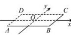
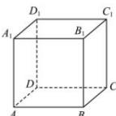

> [!faq]- 全练一本通解析
> **【答案】** 画法见解析
>
> **【解析】**
> 如下图所示,按如下步骤完成:
> 第一步:作水平放置的正方形 ABCD 的直观图,使得 AB=4cm, BC=2cm, 且 $\angle DAB=45^{\circ}$ , 取平行四边形 ABCD 的中心 O, 作 x 轴 // AB, y 轴 // BD, 第二步: 过点 O 作 $\angle xOz=90^{\circ}$ , 过点 A、B、C、D 分别作 $AA_{1}, BB_{1}, CC_{1}, DD_{1}$ 等于 4cm, 顺次连接 $A_{1}B_{1}C_{1}D_{1}$ ,
> 第三步:去掉图中的辅助线,就得到棱长为4的正方体的直观图.
> 
> 
