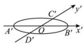
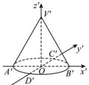
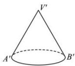

> [!faq]- 全练一本通解析
> **【答案】** 画法见解析
>
> **【解析】**
> （2）如下图所示，按如下步骤完成：
> 第一步:作水平放置的圆的直观图 $\odot O'$ ，使 $A'B'=4\ cm,\ D'C'=2\ cm.$ 第二步:过 $O'$ 作 $z'$ 轴, 使 $\angle x'O'z'=90^{\circ}$ , 在 $z'$ 上取点 $V'$ , 使 $O'$ $V'=4cm$ ,
> 连接 $A'V'$ ， $B'V'$ 。
> 第三步:去掉图中的辅助线,就得到所求圆锥的直观图.
> 
> 
> 
