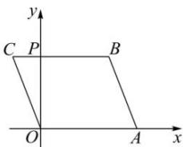

> [!faq]- 全练一本通解析
> **【答案】** 图形见解析
>
> **【解析】**
> 在直观图中, 若 $O'y'$ 与 $B'C'$ 交于点 $P'$ , 则 $C^{\prime}P^{\prime}=2cm,\ P^{\prime}B^{\prime}=4cm,\ O^{\prime}P^{\prime}=2\sqrt{2}cm.$ 在原图形中，OA=6cm，CP=2cm，OP=2O^{\prime}P^{\prime}=4\sqrt{2}cm.
> ∵ BC // OA, BC = OA = 6cm,
> ∴ 原图形 OABC 是平行四边形，
> 如图，
> 
