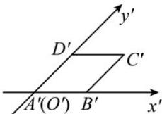

> [!faq]- 全练一本通解析
> **【答案】** C
>
> **【解析】**
> 解析:用斜二测画法画出的水平放置的矩形 ABCD 的直观图,
> 
> 由斜二测画法, 四边形 $A^{\prime}B^{\prime}C^{\prime}D^{\prime}$ 是平行四边形, $A^{\prime}B^{\prime}=2, A^{\prime}D^{\prime}=\frac{3}{2}$ , 所以四边形 $A^{\prime}B^{\prime}C^{\prime}D^{\prime}$ 的周长为 $2\times\left(2+\frac{3}{2}\right)=7$ .
>
> 故选 **C**.
