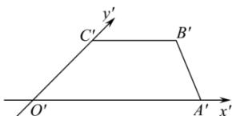

> [!faq]- 全练一本通解析
> **【答案】** 3
>
> **【解析】**
> 如图所示,作出直观图,
> 则 $O^{\prime}C^{\prime}=\frac{1}{2}OC=\sqrt{2}$ ， $\angle A^{\prime}O^{\prime}C^{\prime}=\frac{\pi}{4}$ ， $O^{\prime}A^{\prime}=4, B^{\prime}C^{\prime}=2$ ，
> 梯形 $A^{\prime}B^{\prime}C^{\prime}O^{\prime}$ 的高为 $\sqrt{2}\sin\frac{\pi}{4}=1$ ,
> ∴直观图的面积为 $\frac{(2+4)\times1}{2}=3$ . 故答案为: 3.
> 
