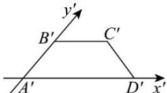

<!-- question-source:start -->
【21】（2023·山东德州高一下期末）如图所示，梯形 $A'B'C'D'$ 是平面图形ABCD用斜二测画法得到的直观图， $A'D'=2B'C'=2$ ， $A'B'=1$ ，则平面图形ABCD中对角线AC的长度为（）

A. $\sqrt{2}$ B. $\sqrt{3}$ C. $\sqrt{5}$ D. 5
<!-- question-source:end -->

![[Q00005746A1]]
