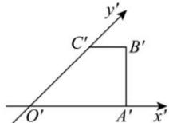

<!-- question-source:start -->
【22】(2023·甘肃白银高一期中)如图,一个水平放置的平面图形的斜二测直观图是直角梯形 $O'A'B'C'$ ，且 $O'A'/B'C'$ ， $O'A'=2B'C'=4$ ， $A'B'=2$ ，则该平面图形的高为（）

A. $2\sqrt{2}$ B. 2 C. $4\sqrt{2}$ D. $\sqrt{2}$
<!-- question-source:end -->

![[Q00005747A1]]
