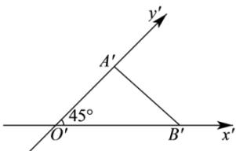

<!-- question-source:start -->
【25】（2024·上海虹口高二期中）如图， $\triangle O'A'B'$ 是水平放置的 $\triangle OAB$ 的直观图，且 $O'A' = 2, O'B' = 3$ ，则 $\triangle OAB$ 的周长为 \_\_\_\_.

<!-- question-source:end -->

![[Q00005750A1]]
