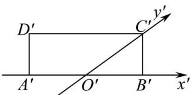

<!-- question-source:start -->
【27】(2024·安徽芜湖高二练习)如图,水平放置的四边形ABCD的斜二测直观图为矩形 $A^{\prime}B^{\prime}C^{\prime}D^{\prime}$ ，已知 $A^{\prime}O^{\prime}=O^{\prime}B^{\prime}=2$ ， $B^{\prime}C^{\prime}=2$ ，则四边形ABCD的周长为\_\_\_\_.

<!-- question-source:end -->

![[Q00005752A1]]
