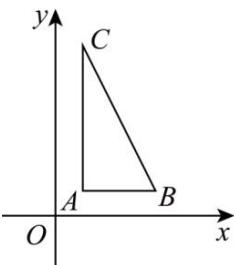

> [!faq]- 全练一本通解析
> **【答案】** B
>
> **【解析】**
> 解析: 在直角坐标系中作出原平面图形 $\triangle ABC$ ，则 $AB = \sqrt{7}$ ， $AC = 2\sqrt{7}$ ， $AC \perp AB$ ，所以 $S_{\triangle ABC} = \frac{1}{2} \times \sqrt{7} \times 2\sqrt{7} = 7$ 。故选：B.
> 
