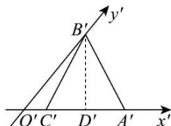
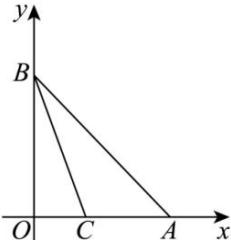

> [!faq]- 全练一本通解析
> **【答案】** D
>
> **【解析】**
> 解析: 在直观图中, $\angle B^{\prime}O^{\prime}A^{\prime}=45^{\circ}$ ,
> 在三角形 $O^{\prime}B^{\prime}A^{\prime}$ 中, 过点 $B^{\prime}$ 作 $B^{\prime}D^{\prime}\perp x^{\prime}$ 于点 $D^{\prime}$ , 则 $A^{\prime}D^{\prime}=C^{\prime}D^{\prime}=1,\quad B^{\prime}D^{\prime}=\sqrt{3}$ 故 $B'O' = \sqrt{2} B'D' = \sqrt{6}$
> 
> 还原直观图得 $\triangle ABC$ 原图如下，
> 
> $AC = 2$
> 由 $B^{\prime}O^{\prime} = \sqrt{6}$ 得 $OB = 2\sqrt{6}$
> 所以 $\triangle ABC$ 的面积为 $\frac{1}{2} AC \cdot OB = \frac{1}{2} \times 2 \times 2\sqrt{6} = 2\sqrt{6}$ .
>
> 故选 **D**
