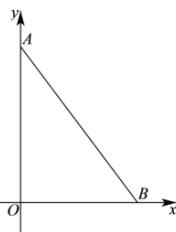

> [!faq]- 全练一本通解析
> **【答案】** 12
>
> **【解析】**
> 作出 $\triangle OAB$ 的图形如下图所示:
> 
> 由图可知， $\triangle AOB$ 为直角三角形，且 $AO \perp OB, OA = 2O'A' = 2 \times 2 = 4, OB = O'B' = 3,$ 由勾股定理可得 $AB = \sqrt{OA^{2} + OB^{2}} = \sqrt{4^{2} + 3^{2}} = 5$ 所以， $\triangle AOB$ 的周长为 $OA + OB + AB = 4 + 3 + 5 = 12$ . 故答案为：12，
