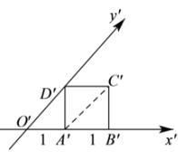
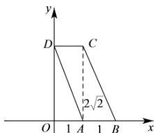

> [!faq]- 全练一本通解析
> **【答案】** $\frac{4\sqrt{2}}{3}$
>
> **【解析】**
> 直观图如图1,则原图形如图2,
> 
> 
> 图1
> 图2
> 则原图形为平行四边形, 面积为 $1 \times 2\sqrt{2} = 2\sqrt{2}$ ,
> 故底面 ABCD 的面积为 $2\sqrt{2}$ ,
> 故该四棱锥的体积为 $\frac{1}{3}\times2\sqrt{2}\times2=\frac{4\sqrt{2}}{3}$ . 故答案为: $\frac{4\sqrt{2}}{3}$
