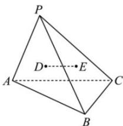

<!-- question-source:start -->
【4】（2024·全国高一专题练习）如图, P 是 $\triangle ABC$ 所在平面外一点, D, E 分别是 $\triangle PAB$ 和 $\triangle PBC$ 的重心. 求证: D, E, A, C 四点共面且 $DE = \frac{1}{3} AC$ .

<!-- question-source:end -->

![[Q00005907A1]]
