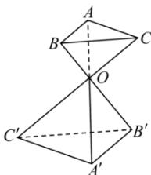

<!-- question-source:start -->
【8】(2016·全国高一课后作业)如图所示, $\triangle ABC$ 和 $\triangle A'B'C'$ 的对应顶点的连线 $AA'$ , $BB'$ , $CC'$ 交于同一点 $O$ , 且 $\frac{AO}{A'O} = \frac{BO}{B'O} = \frac{CO}{C'O} = \frac{2}{3}$ .

（1）证明: $AB//A'B'$ , $AC//A'C'$ , $BC//B'C'$ .

$$
\frac {S _ {\triangle A B C}}{S _ {\triangle A ^ {\prime} B ^ {\prime} C ^ {\prime}}}
$$

<!-- question-source:end -->

![[Q00005911A1]]
