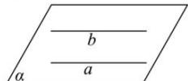
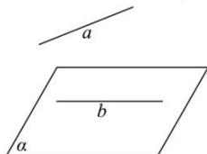

> [!faq]- 全练一本通解析
> **【答案】** D
>
> **【解析】**
> 解析:根据题意可得,如下图所示:
> 
> 若“直线 $a \parallel$ 直线 $b$ ”，则直线 $a$ 可以在平面 $\alpha$ 内；即充分不成立；
> 若“直线 $a \parallel$ 平面 $\alpha$ ”，如下图所示：
> 
> 直线 a 和直线 b 可以异面, 即必要性不成立;
> 所以可知“直线 $a \parallel$ 直线 $b$ ”是“直线 $a \parallel$ 平面 $\alpha$ ”的既不充分也不必要条件,
>
> 故选 **D**
