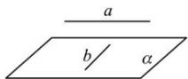
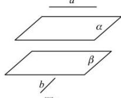
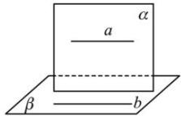

> [!faq]- 全练一本通解析
> **【答案】** D
>
> **【解析】**
> 解析: A 选项, 如图 1, 满足 $a \parallel \alpha$ , $b \subset \alpha$ , 但 a, b 不平行, A 错误;

图1
B 错误, 如图 2, 满足 $a \parallel \alpha$ , $b \parallel \beta$ , $\alpha \parallel \beta$ , 但 a, b 不平行, B 错误;

图2
C 选项, 如图 3, 满足 $a \subset \alpha$ , $b \subset \beta$ , $a // b$ , 但 $\alpha, \beta$ 不平行, C 错误;

图3
D 选项, 若 $a \not\subset \alpha, b \subset \alpha, a // b$ , 由线面平行的判断定理可得 $a // \alpha$ , D 正确. 故选: D

