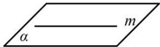
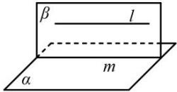

## 3. 直线和平面平行的判定与性质

<table><tr><td></td><td>自然语言</td><td>图形语言</td><td>符号语言</td></tr><tr><td>判定定理</td><td>平面外一条直线与此平面内的一条直线平行,则该直线与此平面平行.</td><td>l</td><td> $\left.\begin{matrix} l \notin \alpha \\ m \subset \alpha \\ l / /m \end{matrix}\right\} \Rightarrow l // \alpha$ </td></tr><tr><td>性质定理</td><td>一条直线和一个平面平行,则过这直线的任一平面与此平面的交线与该直线平行.</td><td></td><td> $\left.\begin{matrix} l // \alpha \\ l \subset \beta \\ \alpha \cap \beta = m \end{matrix}\right\} \Rightarrow l // m$ </td></tr></table>

注意：

（1）用该定理判断直线 a 与平面 $\alpha$ 平行时, 必须具备三个条件:

①直线 a 在平面 $\alpha$ 外, 即 $a \not\subset \alpha$ ;

②直线 b 在平面 $\alpha$ 内, 即 $b \subset \alpha$ ;

③直线 a, b 平行, 即 $a \parallel b$ .

这三个条件缺一不可,缺少其中任何一个,结论就不一定成立.

（2）性质定理可看作直线与直线平行的判定定理,用该定理判断直线 a 与 b 平行时,必须具备三个条件:①直线 a 和平面 $\alpha$ 平行,即 $a \parallel \alpha$ ;

②平面 $\alpha$ 和 $\beta$ 相交, 即 $\alpha \cap \beta = b$ ;

③直线 a 在平面 $\beta$ 内, 即 $a \subset \beta$ . 三个条件缺一不可, 在应用这个定理时, 要防止出现“一条直线平行于一个平面, 就平行于这个平面内一切直线”的错误.
