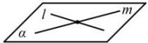
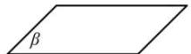
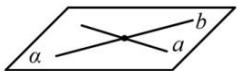
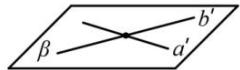
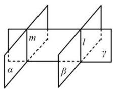

## 4. 平面和平面平行的判定与性质

<table><tr><td rowspan="2">判定定理</td><td>自然语言</td><td>图形语言</td><td>符号语言</td></tr><tr><td>一个平面内的两条相交直线与另一个平面平行,则这两个平面平行.</td><td> </td><td> $\left. \begin{array}{l} l \subset \alpha, m \subset \alpha \\ l \cap m \neq \emptyset \\ l // \beta, m // \beta \end{array} \right\} \Rightarrow \alpha // \beta$ </td></tr><tr><td>推论</td><td>如果一个平面内的两条相交直线分别平行于另一个平面内的两条相交直线,那么这两个平面平行.</td><td> </td><td> $\left. \begin{array}{l} a \subset \alpha, b \subset \alpha \\ a \cap b \neq \emptyset \\ a' \subset \beta, b' \subset \beta \\ a // a', b // b' \end{array} \right\} \Rightarrow \alpha // \beta$ </td></tr><tr><td>性质定理</td><td>如果两个平行平面同时和第三个平面相交,那么它们的交线平行.</td><td></td><td> $\left.\begin{array}{l}\alpha //\beta \\ \alpha \cap \gamma = l \\ \beta \cap \gamma = m\end{array}\right\} \Rightarrow l //m$ </td></tr></table>

## 其他性质：

（1）如果两个平面平行，则其中一个平面内的任意直线都平行另一个平面.

(2) 经过平面外一点有且只有一个平面与已知平面平行.

（3）两条直线被三个平面所截, 截得的对应线段成比例.

(4) 如果两个平面分别平行于三个平面, 那么这两个平面相互平行.

注意: (1) 定理中平行于同一个平面的两条直线必须是相交的.

(2) 面面平行的性质定理也是线线平行的判定定理.

（3）已知两个平面平行, 虽然一个平面内的任何直线都平行于另一个平面, 但是这两个平面内的所有直线并不一定相互平行, 它们可能是平行直线, 也可能是异面直线, 但不可能是相交直线（否则将导致这两个平面有公共点）.
