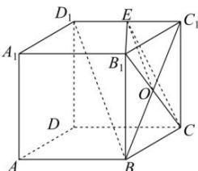

> [!faq]- 全练一本通解析
> **【答案】** $\frac{\sqrt{5}}{3}$
>
> **【解析】**
> 连接 $BC_{1}$ ，交 $B_{1}C$ 于点 O，连接 EO，则 O 为 $BC_{1}$ 的中点.
> 
> $\because BD_{1} // \text{平面 } B_{1} CE, BD_{1} \subset \text{平面 } B_{1} CE, \text{ 平面 } BD_{1} C_{1} \cap \text{ 平面 } B_{1} CE = EO,$ $\therefore EO // BD_{1}$ , 又 $O$ 为 $BC_{1}$ 中点, $\therefore E$ 为 $C_{1} D_{1}$ 中点, $\therefore C_{1} E = \frac{1}{2},$ 则在 $Rt \triangle CC_{1} E$ 中, $CE = \sqrt{CC_{1}^{2} + C_{1} E^{2}} = \sqrt{1^{2} + \left(\frac{1}{2}\right)^{2}} = \frac{\sqrt{5}}{2}$ .
