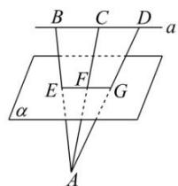

<!-- question-source:start -->
【35】(2023·全国高一专题练习)如图所示, 直线 a// 平面 $\alpha$ , 点 A 在 $\alpha$ 另一侧, 点 B, C, $D \in a$ , 线段 AB, AC, AD 分别交 $\alpha$ 于点 E, F, G. 若 BD = 4, CF = 4, AF = 5, 则 EG 的长为 \_\_\_\_.

<!-- question-source:end -->

![[Q00005938A1]]
