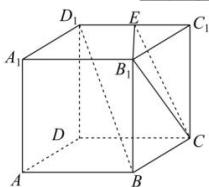

<!-- question-source:start -->
【36】如图, $E$ 是棱长为1正方体 $ABCD - A_{1}B_{1}C_{1}D_{1}$ 的棱 $C_1D_1$ 上的一点, 且 $BD_{1} //$ 平面 $B_{1}CE$ , 则线段 $CE$ 的长为 \_\_\_\_.

<!-- question-source:end -->

![[Q00005939A1]]
