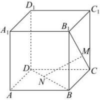

<!-- question-source:start -->
【25】如图,在正方体 $ABCD-A_{1}B_{1}C_{1}D_{1}$ 中,点 $N$ 在 $BD$ 上,点 $M$ 在 $B_{1}C$ 上,且 $CM=DN$ ,求证: $MN$ //平面 $ABB_{1}A_{1}$ .</td></tr><tr><td>
<!-- question-source:end -->

![[Q00005927A1]]
