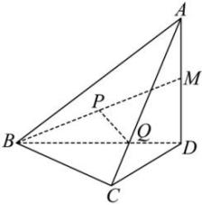

<!-- question-source:start -->
【26】如图,在四面体 $ABCD$ 中, $AD\perp$ 平面 $BCD$ , $M$ 是 $AD$ 的中点, $P$ 是 $BM$ 的中点,点 $Q$ 在线段 $AC$ 上,且 $AQ=3QC$ .求证: $PQ$ //平面 $BCD$ .▷题型2:线面平行的性质的应用</td></tr><tr><td>
<!-- question-source:end -->

![[Q00005929A1]]
