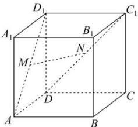

<!-- question-source:start -->
【19】(2022·北京海淀高一阶段练习)如图,在正方体 $ABCD-A_{1}B_{1}C_{1}D_{1}$ 中, $M$ 是 $AD_{1}$ 的中点, $N$ 是 $DC_{1}$ 的中点,求证: $MN$ //平面 $ABCD$ .
<!-- question-source:end -->

![[Q00008887A1]]
