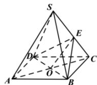

> [!faq]- 全练一本通解析
> **【答案】** 证明见解析：
>
> **【解析】**
> 连接 AC, 交 BD 于点 O, 连接 OE.
> 
> 因为四棱锥 S-ABCD 为正四棱锥,所以四边形 $ABCD$ 为正方形, 即 $O$ 为 $AC$ 中点, 因为 $E$ 为 $SC$ 中点, 所以 $OE$ 为 $\triangle SAC$ 的中位线, 所以 $OE // SA$ , 因为 $OE \subset$ 平面 $BDE$ , $SA \subset$ 平面 $BDE$ , $SA //$ 平面 $BDE$ .
