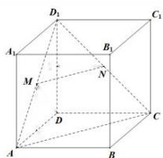

> [!faq]- 全练一本通解析
> **【答案】** 证明见解析
>
> **【解析】**
> （1）
> 
> 依题意, 连接 AC, $AD_{1}$ , $CD_{1}$ .
> 由题意可知 MN 是 $\triangle AD_{1}C$ 底边 AC 上的中位线,
> $$
> \therefore M N \parallel A C
> $$
> $AC \subset$ 平面 $ABCD, MN \not\subset$ 平面 $ABCD,$
> ∴ MN // 平面 ABCD;
