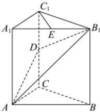

<!-- question-source:start -->
【24】(2024·海南高二期末)直三棱柱 $ABC-A_{1}B_{1}C_{1}$ 中, $E$ 为 $A_{1}B_{1}$ 的中点, $D$ 为 $CC_{1}$ 的中点,求证: $C_{1}E$ //平面 $AB_{1}D$ .
<!-- question-source:end -->

![[Q00008892A1]]
