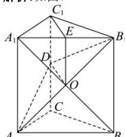

> [!faq]- 全练一本通解析
> **【答案】** 证明见解析
>
> **【解析】**
> 如图:
> 
> $$
> A B _ {1}
> $$
> $$
> A _ {1} B
> $$
> $$
> E O, D O
> $$
> $$
> C C _ {1}
> $$
> $$
> E O / / A A _ {1}
> $$
> $$
> E O = \frac {1}{2} A A _ {1}
> $$
> $$
> C _ {1} D / / A A _ {1}
> $$
> $$
> E O / / C _ {1} D, E O = C _ {1} D
> $$
> $$
> C _ {1} D = \frac {1}{2} A A _ {1}
> $$
> $$
> C _ {1} E \not \subset
> $$
> $$
> E O D C _ {1}
> $$
> $$
> C _ {1} E / / D O
> $$
> $$
> A B _ {1} D, D O \subset
> $$
> $$
> A B _ {1} D
> $$
> $$
> C _ {1} E / /
> $$
> $$
> A B _ {1} D
> $$
