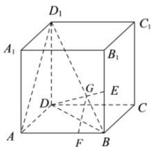

> [!faq]- 全练一本通解析
> **【答案】** 证明见解析
>
> **【解析】**
> 连接 $BD,AD_{1}$ 因为在正方体ABCD- $A_{1}B_{1}C_{1}D_{1}$ 中， $BB_{1} / / DD_{1}$ 所以 $\angle EBG = \angle DD_1G,\angle D_1DG = \angle BEG$ 所以△BEG∽△D1DG，
> 所以 $\frac{BG}{D_{1}G}=\frac{BE}{DD_{1}}$ 因为点 E 是 $BB_{1}$ 的中点， $BB_{1}=DD_{1}$ ，
> 所以 $\frac{BG}{D_{1}G}=\frac{BE}{DD_{1}}=\frac{1}{2}$ 因为 AF=2FB，
> 所以 $\frac{BG}{D_{1}G}=\frac{BF}{AF}=\frac{1}{2}$ 所以 FG // $AD_{1}$ ,
> 因为 $FG \not\subset$ 平面 $AA_{1}D_{1}D$ ， $AD_{1} \subset$ 平面 $AA_{1}D_{1}D$ ，
> 所以 $GF \parallel$ 平面 $AA_{1}D_{1}D$ .
> 
