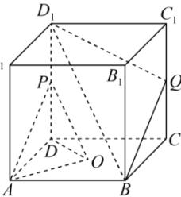

<!-- question-source:start -->
【54】如图, 正方体 $ABCD - A_{1}B_{1}C_{1}D_{1}$ ，O 为底面 ABCD 的中心，P，Q 分别为 $DD_{1}$ ， $CC_{1}$ 的中点，平面 $D_{1}BQ$ 与底面 ABCD 交于直线 l，求证：AO // l.

<!-- question-source:end -->

![[Q00005956A1]]
