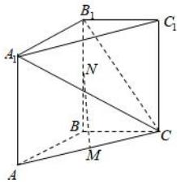

<!-- question-source:start -->
【49】如图, 在直三棱柱 $ABC-A_{1}B_{1}C_{1}$ 中, $M$ , $N$ 分别是 $AC$ 和 $BB_{1}$ 的中点, 求证: $MN//$ 平面 $A_{1}B_{1}C$ .</td></tr><tr><td>
<!-- question-source:end -->

![[Q00005950A1]]
