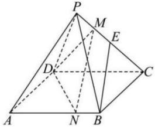

<!-- question-source:start -->
【50】已知正四棱锥 $P-ABCD$ , 点 $M$ ,  $N$ 分别在线段 $PC$ ,  $AB$ 上, 且 $AN=2NB$ ,  $PC=4PM$ ,  $E$ 为 $PC$ 的中点, 求证: $BE//$ 平面 $DMN$ .</td></tr></table>
<!-- question-source:end -->

![[Q00005952A1]]
