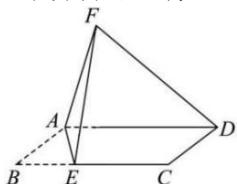

<!-- question-source:start -->
【42】(2022·全国模拟预测)如图所示,在平行四边形ABCD中,E是BC上靠近点B的三等分点,将 $\triangle AEB$ 沿AE折起至 $\triangle AEF$ .若L在线段DF上,当L为何位置时,CL//平面AEF.

<!-- question-source:end -->

![[Q00008903A1]]
