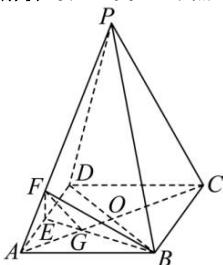

> [!faq]- 全练一本通解析
> **【答案】** $\lambda = 3$
>
> **【解析】**
> 设 $AQ$ 交 $BE$ 于点 $G_{\mathrm{c}}$ 连接 $EG_{\mathrm{c}}$ 加图所示：
> 解析:设 AO 交 BE 于点 G, 连接 FG, 如图所示:
> 
> O, E 分别是 BD, AD 的中点, $\triangle AEG \sim \triangle GBC$ , 则 $\frac{AG}{GC} = \frac{1}{2}$ ,
> 则 $\frac{AG}{AC} = \frac{1}{3}$ ,
> PC // 平面 BEF, PC ⊂ 面 PAC, 平面 BEF ∩ 平面 PAC = GF,
> 故 GF // PC, 故 $\frac{AF}{AP} = \frac{AG}{AC} = \frac{1}{3}$ , 故 $\lambda = 3$ .
