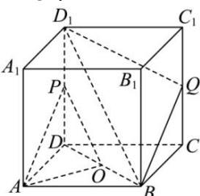

<!-- question-source:start -->
【59】如图, 在正方体 $ABCD - A_{1}B_{1}C_{1}D_{1}$ 中, O 为底面 ABCD 的中心, P 是 $DD_{1}$ 的中点, 设 Q 是 $CC_{1}$ 上的点, 当点 Q 在什么位置时, 平面 $D_{1}BQ \parallel$ 平面 PAO?

<!-- question-source:end -->

![[Q00005961A1]]
