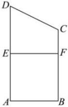
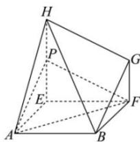

<!-- question-source:start -->
【60】如图1, 在梯形ABCD中, $BC \parallel AD$ , $AB \perp AD$ , $AB = 4$ , $BC = 6$ , $AD = 8$ , 线段AD的垂直平分线与AD交于点E, 与BC交于点F, 将四边形CDEF沿EF折起, 使C, D分别到点G, H的位置, 得到几何体ABFEHG, 如图2所示, 判断线段EH上是否存在点P, 使得平面PAF//平面BGH, 若存在, 求出点P的位置; 若不存在, 请说明理由.

图1
图2
<!-- question-source:end -->

![[Q00005962A1]]
